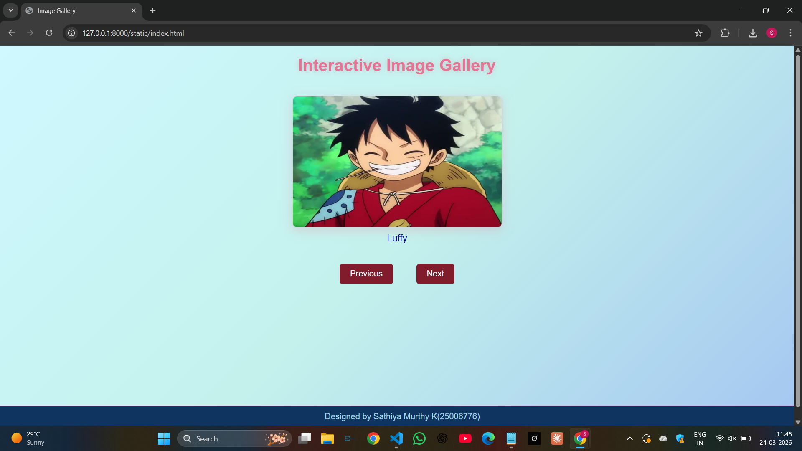
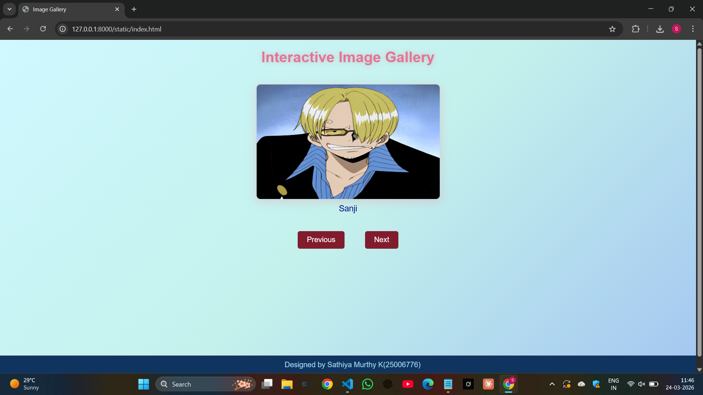
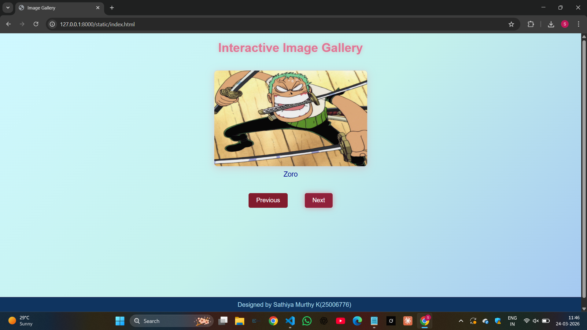
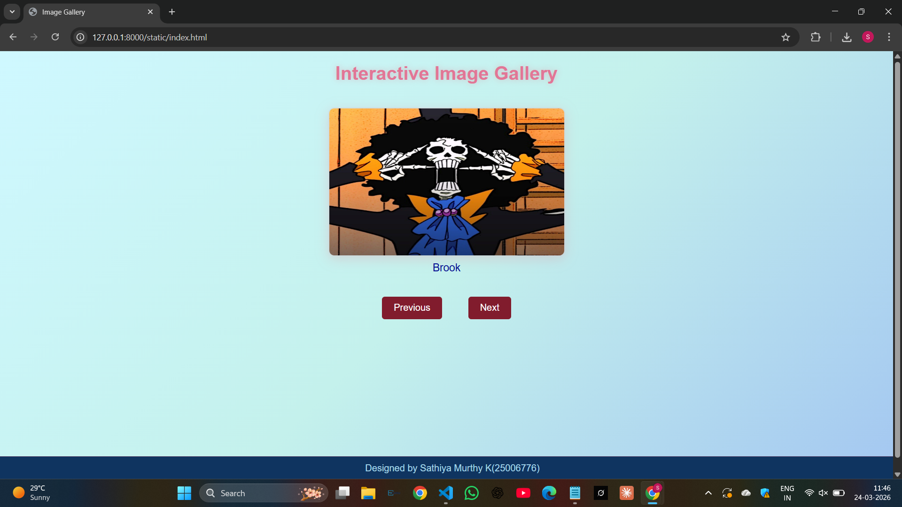
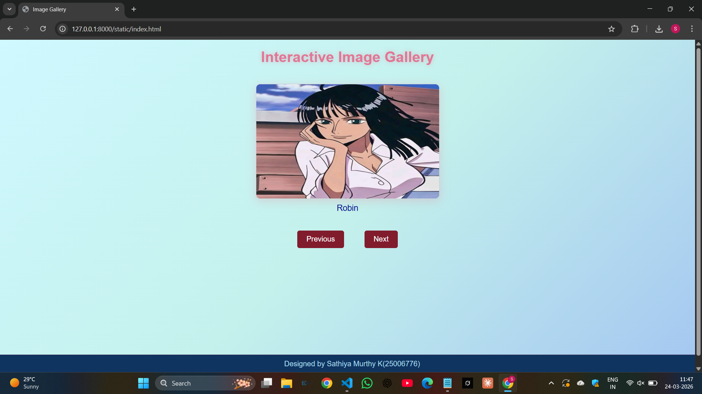

# Ex.07 Design of Interactive Image Gallery
## Date: 24/03/2026

## AIM:
To design a web application for an inteactive image gallery for a minimum five images with next and previous buttons.

## DESIGN STEPS:

### Step 1:
Clone the github repository and create Django admin interface.

### Step 2:
Change settings.py file to allow request from all hosts.

### Step 3:
Use CSS for positioning and styling.

### Step 4:
Write JavaScript program for implementing interactivity.

### Step 5:
Validate the HTML and CSS code.

### Step 6:
Publish the website in the given URL.

## PROGRAM:
```
<html>
<head>
<title>Image Gallery</title>
<link rel="stylesheet" href="gallery.css">
</head>
<body>
<h1>Interactive Image Gallery</h1>
<div class="gallery">

<p id="caption">Luffy</p>
<button onclick="prevImage()">Previous</button>
<button onclick="nextImage()">Next</button>
</div>
<script src="scripts.js"></script>
<footer>
Designed by Sathiya Murthy K(25006776)
</footer>
</body> 
</html>

gallery.css

body{
text-align:center;
font-family:Arial;
background:linear-gradient(135deg, #cff8ff, #c4f1ec, #a3c6f1);
color: #e0e0e0;
margin: 0;
padding: 0;
min-height: 100vh;
}
h1{
margin-top:20px;
color: #e17696;
text-shadow: 0 0 10px rgba(233, 69, 96, 0.3);
}
.gallery{
margin-top:40px;
}
.gallery img{
width:400px;
height:250px;
border-radius:10px;
box-shadow:0 5px 20px rgba(236, 112, 133, 0.25);
border: 2px solid rgba(237, 132, 149, 0.2);
}
#caption{
font-size: 18px;
color: #050c93;
margin-top: 10px;
}
button{
padding:10px 20px;
margin:20px;
font-size:16px;
background: #811c2d;
color: #ffffff;
border:none;
border-radius:5px;
cursor:pointer;
transition: background 0.3s, box-shadow 0.3s;
}
button:hover{
background: #90213b;
box-shadow: 0 0 15px rgba(233, 69, 96, 0.5);
}
footer{
background: #0f3460;
color: #a8d8ea;
padding:10px;
position:fixed;
bottom:0;
width:100%;
border-top: 1px solid rgba(233, 69, 96, 0.3);
}

script.js

let images = ["luffy.jpg","sanji.jpg","zoro.jpg","brook.jpg","robin.jpg"];
var captions=["Luffy","Sanji","Zoro","Brook","Robin"]
var index = 0;
function nextImage(){
index++;
if(index >= images.length){
index = 0;
}
document.getElementById("galleryImage").src = images[index];
document.getElementById("caption").innerHTML = captions[index];
}
function prevImage(){
index--;
if(index < 0){
index = images.length - 1;
}
document.getElementById("galleryImage").src = images[index];
document.getElementById("caption").innerHTML = captions[index];
}

```
## OUTPUT:











## RESULT:
The program for designing an interactive image gallery using HTML, CSS and JavaScript is executed successfully.
